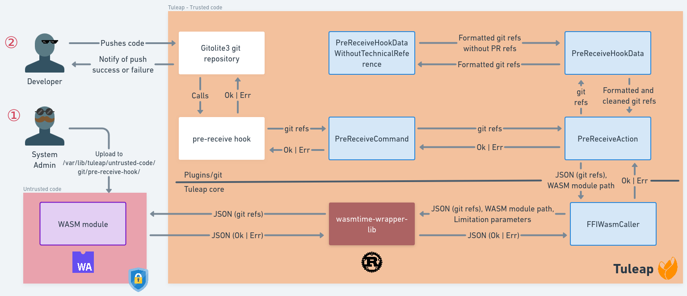

# Untrusted code execution

This section covers how to setup and execute web assembly hook.

## Pre-receive git hook

Each time you push something (commit, tag) to a remote git repository, this last one executes a pre-receive
command ([Git documentation](https://git-scm.com/docs/githooks#pre-receive)).

### How it works?

As a developer, you write some lines of code. When you push them, the git repository calls the pre-receive hook with the
commits references. This hook sends these references to a Tuleap command which triggers a Tuleap
action: `PreReceiveAction`.

This action does 2 things:

1. First of all it formats references and removes the ones related to a pull request
2. Then it sends them to `FFIWasmCaller` with the path to the Web Assembly module

This object calls a C library built from a Rust library with references and wasm module. This library is a wrapper around
Web Assembly runtime Wasmtime. It calls the wasm module and spy it to check if everything goes well.

The Web Assembly module is a script written by a system administrator. It takes the git references as input, and
must return if it accepts them or not. For example, it can check tags and will reject the push if tags are not incremental.

## Artifact post-action

This feature need to have plugin `tracker-cce` installed and enabled.

When an artifact is created or updated, some actions are run: send webhooks, send mails, ... And also execute custom
code.

As for [pre-receive git hook](#pre-receive-git-hook), this action need a WASM module.

- The module receives as input a payload same as [Tracker webhooks](https://docs.tuleap.org/user-guide/integration/webhook.html#tracker)
- The module must output a payload identical to the one for REST API `PUT /api/artifacts/:id`

An example module is available in [plugins/tracker_cce/wasm_modules/post-action-add-comment](../plugins/tracker_cce/wasm_modules/post-action-add-comment).
More details are available in its [README](../plugins/tracker_cce/wasm_modules/post-action-add-comment/README.md).
