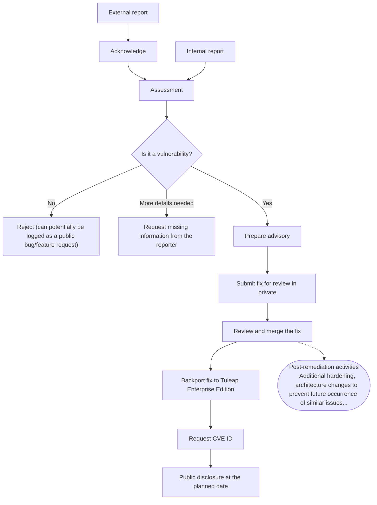

# Vulnerability response process runbook

This runbook can only be executed by a [Tuleap Integrator](../integrators.md).
More details can be found in the [vulnerability response guide](./vulnerability-response.md).

1. **Intake**
    - A report is received from an external source (e.g. an email to security@tuleap.org or a support ticket from a customer)
    - The report is acknowledged within 3 (French) business days
    - If necessary, means of communication are defined with the reporter
2. **Assessment**
   - Determine if the issue is a security issue or not
   - Reporter is informed of the result of the assessment
3. **Prepare the advisory**
   - Create a new advisory in the [Tuleap Requests tracker using the provided template](./templates/tuleap-request.md)
4. **Fix**
   - Do the fix and publish it for review targeting the `security` branch on gerrit.tuleap.net in order to make the
   patch private (`git push gerrit HEAD:refs/for/security%l=ReviewQueue+2`)
   - The review and merge of the fix is made by another integrator using [the standard procedure](./../integrators.md)
   - If applicable, the reporter can be involved at this step notably to get feedbacks on the fix itself
5. **Backport to Tuleap Enterprise Edition supported releases**
6. **Obtain a CVE ID**
    - Create a [new draft security advisory on GitHub](https://github.com/Enalean/tuleap/security/advisories/new) using
   [the template](./templates/github-advisory.md)
    - Request the CVE ID on the draft GitHub security advisory
    - Update the artifact in the Tuleap Requests tracker with the CVE ID once it is assigned
    - Communicate the CVE ID to the reporter
7. **Public disclosure**
    - The advisory in the Tuleap Requests tracker is made public
    - The GitHub security advisory is published
    - The issue is mentioned in the monthly Tuleap release notes

