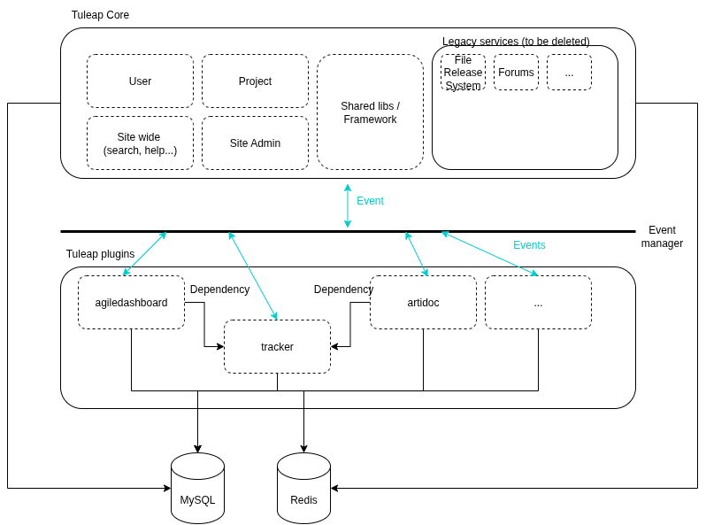

# Developer guide

Tuleap is a Free and Open Source software developed since 2001 under
GPLv2 license. Contributions are welcomed, on Tuleap Core, on plugins,
in documentation, etc.

Development of a Tuleap extension, outside of the main development tree
is hard and you are likely to shoot yourself in the foot if you do so.
The main reason is that Tuleap internal API is not guaranteed, it can
change at any moment for any reasons.

REST API & Webhooks, on the other hand are very carefully maintained and
we ensure, as much as possible the backward compatibility. We (the core
team) strongly recommend to look this way for your developments.

This guide will gives you the insights to start your contributions to
Tuleap:

-   Setting up your environment
-   Push your code for review to integrators
-   Understand Tuleap internals

You can also find help for your dev related questions on the [chat in
the #general channel](https://chat.tuleap.org/).

## Disclaimer

Documentation of a living tool is hard to achieve and, in case of
doubts, the source code is always the reference.

When working with sources, you must look closely to [Architecture Decision Records](./decisions/README.md) that will give insights on the evolutions of the code base and what is expected / current norm.

## High-level architecture

The following picture is a very high-level view of Tuleap Architecture. The main information to keep in mind:
* Historically, Tuleap was a monolith. A plugin system was introduced to bring composability.
* Tuleap Core corresponds to
  * The central concepts of Tuleap: User, Projects, Services, Groups, Permissions, ... management
  * The site wide features: site administration, help, welcome page, etc
  * The shared libs (internal Framework)
  * The historical/legacy services. Those will eventually be deleted or converted into plugins.
* Tuleap Plugins can provide features like
  * a Service like Tracker, Kanban, TestManagement, ...
  * or be transversal like LDAP, OpendIDConnect, ...

Source: [Tuleap Architecture.drawio](./Tuleap_Architecture.drawio)

You can also have a look at a more [infra oriented diagram](../slides/life-tuleap-request/public/img/Prod_SSRF.webp).
This diagram is extracted from a more complete presentation on [Requests Lifecycle](./slides/life-tuleap-request).

## Getting started

### Setup you environment

1. [Clone Tuleap](./quick-start/clone-tuleap.md)
1. [Install Docker](./quick-start/install-docker.md)
1. [Run Tuleap](./quick-start/run-tuleap.md)

### Prepare a new development

* [Prepare features](./story-elaboration.md)

### Submit a contribution

* [Expected code](expected-code.md)
* [Submit changes](patches.md)

## Development 101, what you need to know

* [Front end](./front-end.md)
* [Back end](./back-end.md)
* [Tests](./tests.md)
* [Internationalization](./internationalization.md)
* [Integrators](./integrators.md)

## Advanced topics

* [Development tools](development-tools.md)
* [Release](./release.md)
* [LDAP](./ldap.md)
* [Realtime](./realtime.md)
* [Trackers](./trackers.md)
* [Gerrit](./gerrit.md)
* [Project background](./project-background.md)
* [Gitlab](./gitlab.md)
* [Untrusted code execution](./untrusted-code-exec.md)
