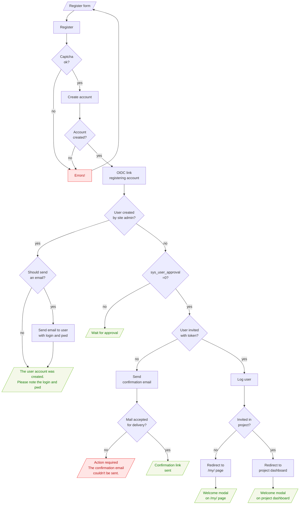

# Flowcharts

The aim of this section is to provide some flowcharts representation for
some parts of Tuleap.

## User authentication

See dedicated flowchart in Security [user-authentication-flowchart](https://docs.tuleap.org/administration-guide/users-management/security/user-authentication/authentication-flowchart.html#user-authentication-flowchart)

## User registration

*Last revision of the graph: February 8th, 2023*

