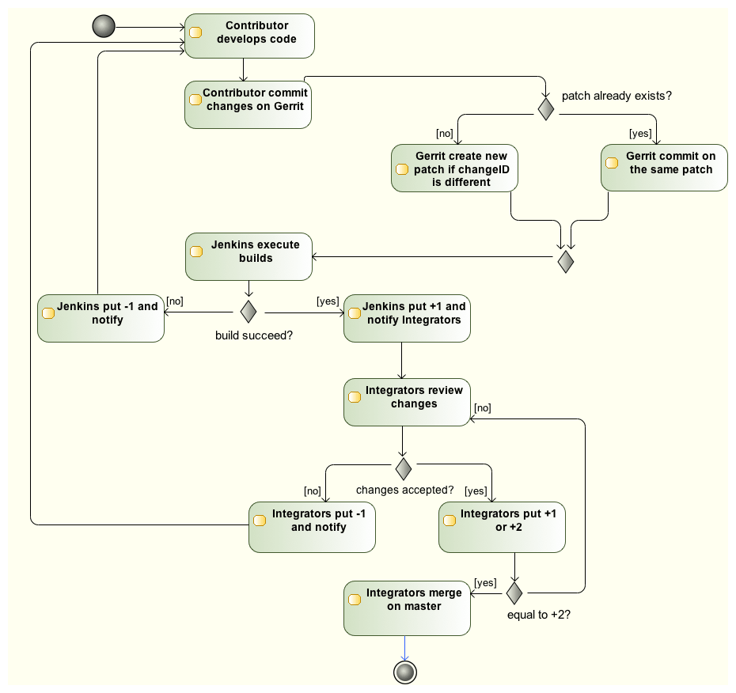

# Push your code

As a prerequisite, please read [Don't "Push" Your Pull
Requests](https://www.igvita.com/2011/12/19/dont-push-your-pull-requests/).

The Tuleap project uses Gerrit to ensure a proper review and integration
of contributed code. It means that:

-   Each and every commit is reviewed individually
-   A Tuleap-contributor can vote between -2..+2 on each contribution
-   A Tuleap-integrator submit is mandatory



Development repository is hosted on <https://gerrit.tuleap.net>

You can checkout <https://gerrit.tuleap.net/admin/repos/tuleap>. You
need an account on gerrit in order to do the checkout.

The reference repository, stable, is "the true master" (ie. it's from
this repository that releases are rolled out). There is a mirror of
stable repository available on [GitHub](https://github.com/Enalean/tuleap/)
that is synchronized on every push on master.

## Integration rules

For a commit to reach the main development branch (`master`), it *must* comply with following rules:
* [Gerrit tests](./tests.md#what-is-run-and-when--aka-continuous-integration-rules-) must pass
* An Integrator must review the code prior to the integration.
    * When two Integrators are doing pair programming, a third reviewer is not required:
      * The co-author (the one that is not performing the commit) must be mentionned in the commit message with `Signed-off-by: Author <email>`
      * The co-author must perform the integration of the submitted patch on it's own development environment (regular integration flow via gerrit, minus the review)
    * When an Integrator is doing pair programming with a contributor, a independent review from another integrator is required.
    * An Integrator is not allowed to self-merge their own patches. If this happens, patch must be reverted as soon as possible.

## Setting up your environment

1.  configure your local config to rebase when you pull changes locally:

``` bash
$> git config branch.autosetuprebase always
```

2.  Configure your gerrit environment

Login on <https://gerrit.tuleap.net> (same account than tuleap.net)
and publish your ssh key (not needed if you are using http as
transport). In Tuleap folder:

``` bash
$> git remote add gerrit ssh://USERNAME@gerrit.tuleap.net:29418/tuleap && scp -p -P 29418 USERNAME@gerrit.tuleap.net:hooks/commit-msg .git/hooks/
```

## Push you changes

Tuleap follows the "master only" approach: each and every feature (or
fix) shall be decomposed in small chunks meant to be included into
master.

Most of the time (everything but small bug fix) the development of a
feature require several commits. Therefore, you should decompose your
work so each commit is small progress toward your goal: the final
feature.

Each commit should work but, most important, should not break anything.

### Commit message

A good contrib has a good commit message. You can look at [Tuleap WIP
dashboard](https://gerrit.tuleap.net/p/tuleap/+/dashboard/main:wip) to
see what is expected.

Basically a good commit message has:

-   One summary line that starts with the artifact reference (request
    #123, story #21)
-   Summary line \~50 chars
-   A description that explains the intent of the change (WHY you made
    those changes and not WHAT is inside the commit)

You should always reference a public artifact in your commit:

-   You should reference a
    [request](https://tuleap.net/plugins/tracker/?tracker=140) when
    it\'s bug.
-   You should reference a
    [story](https://tuleap.net/plugins/tracker/?tracker=147) when it\'s
    a new development.
:::

### Publish workflow

The workflow is always the same:

1.  Create a local branch
2.  Hack & commit within the branch
3.  Before publishing, ensure every commit is relevant (history rewrite)
4.  Push in draft
5.  Ensure everything is correct gerrit side
6.  Publish !

Detailed steps:

1.  Create local branch:

``` bash
$> git checkout -b my_fix
```

2.  Hack & commit

``` bash
$> $EDITOR ...
$> git commit -am "stuff"
```

3.  Prepare for publish

Here you look at the history and decide whether all the intermediate
steps (commits) are relevant or if you need to clean up a bit

``` bash
$> git fetch origin
$> git rebase origin/master
$> git log origin/master...
```

If there is only one commit, no problem (ensure there is a public
reference like request #1234) you can move one.

If there are several small commits (like "Work in progress", "typo",
...) they should be "squashed" together with `git rebase -i`. Example:

``` bash
$> git rebase -i origin/master
-> you get an editor with
pick c36944f request #123: validate git repository name
pick 098369f fix tests
pick 3e040e7 typo
```

Here we have 3 commits but what we want to publish is one commit with
the 3 changes. To do that, you can change the commands in the
`git-rebase-todo` file like:

``` bash
$> git rebase -i origin/master
pick c36944f request #123: validate git repository name
fixup 098369f fix tests
fixup 3e040e7 typo
```

Save and quit, git will squash the 3 commits in one:

``` bash
$> git log origin/master...
c36944f request #123: validate git repository name
```

You are ready to publish !

4.  Send for review

``` bash
$> git push origin HEAD:refs/for/master%wip
```

5.  Check result on gerrit

The push command should have an url as output, open it and check that
everything is fine.

6.  Publish

When everything is allright, start the review ("Start review" button)
and set "tuleap-integrators" as reviewers

## Update a contribution

You got a review and you need to make a change? There are several ways
to do it

1.  Commit fix and rebase
2.  Checkout and amend

### Commit fix and rebase

The basic workflow is:

1.  checkout your branch
2.  make the modifications
3.  commit the fix with commit message like "fix issue" (we will
    squash it after)
4.  rebase & fixup
5.  push draft
6.  publish

Most of the things were already described in the precedent section, we
will focus on the "rebase and fixup".

Once you made your fix, the result of a `git log` is
something like:

``` bash
$> git log
c36944f request #123: validate git repository name
098369f fix issue from code review
```

Then, you want to incorporate the fix with the initial commit, so you
need to rebase:

``` bash
$> git rebase -i origin/master
pick c36944f request #123: validate git repository name
pick 098369f fix issue from code review
```

Make your changes:

``` bash
$> git rebase -i origin/master
pick c36944f request #123: validate git repository name
f 098369f fix issue from code review
# save and let rebase do the job
```

Now you only have one commit and you can push and eventually publish.

This works best when

-   You have few commits in your branch
-   Those commits are not modifying the same place you have to modify

This doesn't work when:

-   Someone else modified your commit (you will have to follow the
    "Checkout and amend" way)

### Checkout and amend

In the gerrit interface for your patchset, you have a "Download"
section with a ready to copy/paste git command. Ensure "checkout" is
selected and copy/paste into your git repository.

You should get a message like:

``` bash
$ git fetch ssh://vaceletm@gerrit.tuleap.net:29418/tuleap refs/changes/50/5050/3 && git checkout FETCH_HEAD
remote: Counting objects: 13902, done
remote: Finding sources: 100% (10/10)
remote: Total 10 (delta 9), reused 9 (delta 9)
Unpacking objects: 100% (10/10), done.
From ssh://gerrit.tuleap.net:29418/tuleap
 * branch            refs/changes/50/5050/3 -> FETCH_HEAD
Warning: you are leaving 1 commit behind, not connected to
any of your branches:

  457871b request #8804 TV5 : accented letters converted to HTML entities when switching from HTML format to Text format

If you want to keep them by creating a new branch, this may be a good time
to do so with:

 git branch new_branch_name 457871b

HEAD is now at 7de74b4... request #8840 Remove usage of Bless
```

You can make your own changes.

Then you should `amend` the commit with your changes:

``` bash
$ git commit -a --amend
```

And finally you can push your changes (git push origin
HEAD:refs/for/master%wip & publish)

This works best when

-   You have only one commit to fix
-   You no longer have the commit locally
-   Someonelse commited in your patchset (so your local reference is no
    longer up-to-date)

This far from ideal when

-   You have commits with dependencies (the dependent commits will be
    OUTDATED)
