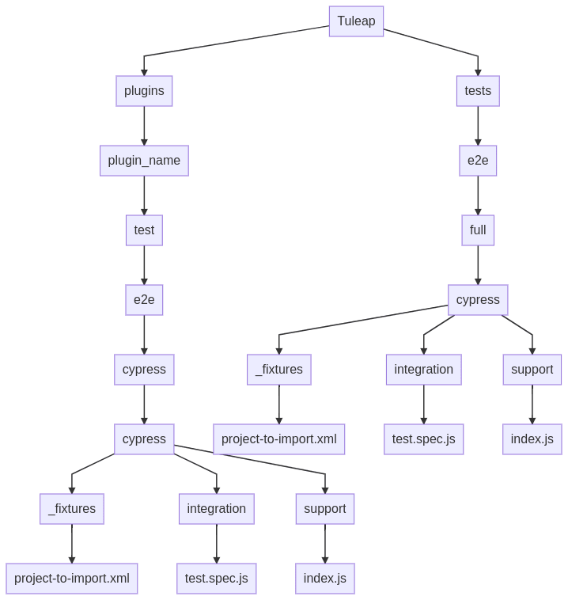

# End to end tests

## Cypress tests

All end-to-end tests are written with [Cypress](https://www.cypress.io).

### Writing good tests

Cypress tests come in addition to manual tests defined in our
TestManagement tool. The major advantage of cypress is that tests are
run every night and warn us quickly if something bad happens.

One of the main difficulties in our end-to-end workflow is having a relevant test suite:

- Tests covered by Cypress should not aim to eliminate
  TestManagement test definitions. That means that when we are
  working on a subject, before starting to write any code, we must
  think about what test we want to cover and who will execute the
  test (is the feature for everybody, for project admin ...).
  Once it's done, we can check if we have differences with our
  TestManagement test suite and adapt the TestManagement suite
  with what has been identified.
- When we add new tests in Cypress that don't exist in
  TestManagement, we must add them as a new TestManagement
  definition.
- When TestManagement test definitions can't fully be covered by Cypress, then we should split them:
    - one part covered by Cypress
    - one part which will be done manually during validation

### Best practises for writing tests

-   It's better to have tests split by user roles.
-   Test should be executed by the least-powered user (don't use
    project administrator for everything).
-   Multiple `describe` and small `it` will help us debug what's
    going on when tests fail.
-   Multiple TestManagement test definitions can not be covered by a
    simple testdefinition (`ttm` tool won't do the report
    automatically). In that case you should split your Cypress test
    and link each TestManagement test definition to a smaller `it`.
-   Always put your Cypress tests in the relevant plugin. End-to-end
    tests should still respect the plugin architecture.

### Write tests

If you want to run all cypress tests locally just launch:

``` bash
$> make tests_cypress
```

You will be able to see the results of the test execution in
`tuleap/test_results_e2e_full`.

If you want to add new tests, you should use the cypress dev image:

``` bash
$> make tests_cypress_dev
```

It will launch a local container with a bunch of projects (defined in
`tests/e2e/_fixtures`).

Before launching the Cypress electron app, you must be able to reach the
"test" Tuleap container at `https://tuleap/`. Cypress will run tests
on this URI. Add a new entry in the `/etc/hosts` file, the IP should
correspond to the IP of your container named `e2e-tests_tuleap_1`.

``` bash
$> sudo vi /etc/hosts
172.18.0.2 oauth2-server-rp-oidc
172.18.0.4 tuleap
```

The IP address should be written at the end of the output from
`make tests_cypress_dev`. If you can't find it, run this command:

``` bash
$> docker inspect e2e-tests_tuleap_1
# At the end of the big JSON output, there is a section named "NetworkSettings". Inside it, there is "Networks" and then "IPAddress"
```

After saving the `/etc/hosts` file, verify that you can reach a working
Tuleap at <https://tuleap/>. If you do not see a Tuleap Login screen,
something is broken in the Tuleap container and tests will all fail.

The IP address will change every time you run `make tests_cypress_dev`.
You should edit `/etc/hosts` each time.

Once the container has started, you should be able to launch the Cypress
electron app. The test structure respects the Tuleap distinction between
core and plugins.

To write tests in Tuleap core, go in core folder and run
`npx cypress open`

``` bash
$> cd tuleap/tests/e2e/full/
$> npx cypress open
```

To write tests in plugins, go in plugin folder and run
`npx cypress open`

``` bash
$> cd tuleap/plugins/<plugin_name>/tests/e2e/cypress/
$> npx cypress open
```

The electron app will be able to run only when the Tuleap container is
fully started. If <https://tuleap/> is unreachable make sure that
container initialisation has finished. If it does not solve your issue,
verify the IP in your `/etc/hosts` file.
:::

As a reminder, an architecture diagram is available:



## Automated tests

Some of our validation tests are executed by the CI. To declare a test
as automated, follow these steps:

On your dev platform

-   Checkout the patch introducing the new tests
-   `make tests_cypress`
-   in `test_results_e2e_full` look for the `result<sha1>.xml`
    corresponding to the tests you are automating

In TTM open the test Validation Execution tracker

-   Open the artifact(s) correponding to the test you have automated
-   You should find a field `Automated tests`
-   Enter the `testcase` name into this field
-   In the field `Refactoring` choose the value `moved to cypress` (in
    order to see which tests must be run by the CI)
