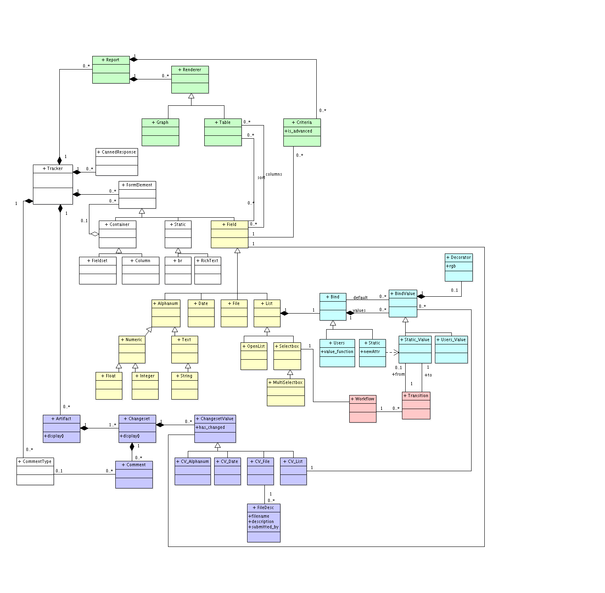

# Trackers

## Structure

Here is a (old) global overview of the structure of trackers. The aim is
to give to the developer a bird's-eye view of objects relationship and
underlying database structure.

## Creating a new field

Here are important points to be checked while developing a new field.
This applies also for new types of bind for list fields. Please note
that some points may be irrelevant for some type of fields.

-   Setup acceptance criteria in test suite
-   Tracker Field Structure
    -   Specific properties?
    -   Field can be switch to another type (only sb/msb)
    -   Shared Fields
    -   Import/Export XML
    -   Field is duplicated on tracker inheritance (both tracker and
        project creation)
    -   Definition is given through REST (representations)
    -   Migrate field from TV3 (if not done)
    -   Does new field can be used for burndown?
    -   Can the field be required?
    -   What level of permissions this field supports?
-   Artifacts
    -   Export/import CSV
    -   What does 'None' mean for this field?
    -   Default value
    -   Field is involved in notifications
    -   New value is sent in notifications
    -   Diff of the field appears in changesets
    -   New value is Copyed on Artifact copy
    -   New value can be used in semantic
    -   New value can be updated on masschanges
    -   On an artifact with artifact links, on creating directly a child
        the field can be used
-   Reports
    -   Field is searchable through criteria
    -   Field is displayed as a column in table
    -   Field is used to sort
    -   Field is used for aggregates
    -   Field is used to build charts
    -   Field is used to build cardwall
-   Angular
    -   Create/ edit modal
    -   Cardwall edit in place
    -   Card field in planning v2
    -   Card field in kanban + filter + highlight
    -   Does field can be directly updated in Cardwall
    -   Modal edit Release
    -   Modal add a Task
-   User documentation is accurate
