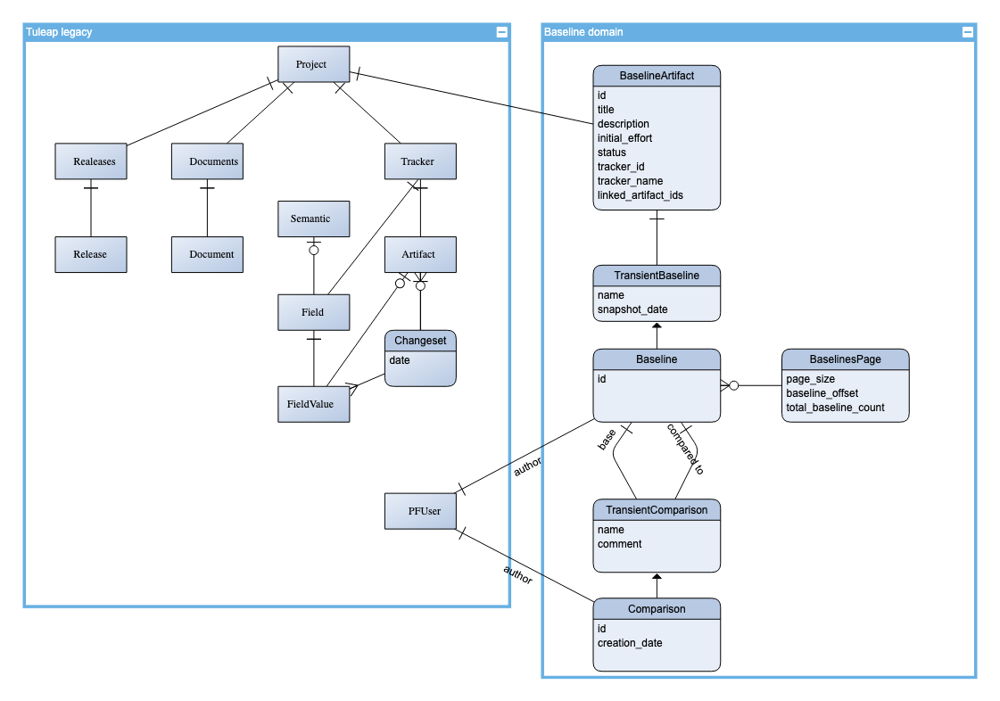
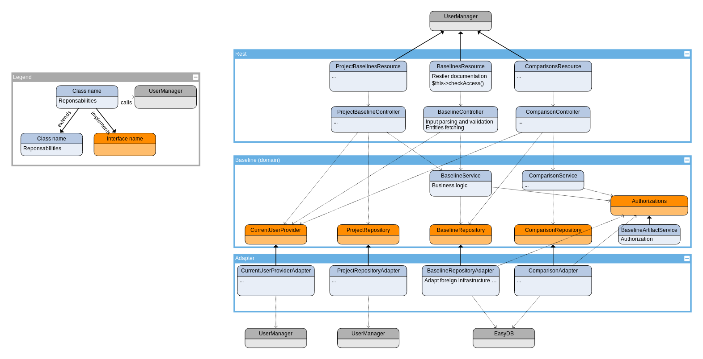

# Backend

## Data model

## Components architecture

Note: this diagram illustrates components architecture, so all classes are not represented here.

**Hexagonal architecture** is followed here in order to limit technical debt on legacy code to corrupt baseline code base. This allows to keep baseline codebase testable as much as it can be (except for adapters, see below).

More over, this architecture allows to follow some **Domain Driven Design** principles which make code easier to understand, therefore to maintain.

This way, codebase is splitted in 3 main namespaces:

- **REST**: this namespace exposes domain as REST services with handling boilerplate and technical stuff (Restler configuration, input parsing and validation, output serialisation, exceptions convertion...).

- **Domain**: this namespace represents the domain of baseline plugin. It explains what this plugin do for the domain. It should not depends on any external library or legacy code. Interfaces are used to reverse dependency.

- **Adapter**: this an anti-corruption layer which prevent legacy code to corrupt baseline codebase. So, this namespace is potentialy the most difficult to test. It is also used to abstract infrastructure (ex: database) in order to prevent technical code to invade domain.

## Security policy

### Authentication

This step is handled by **resources** (in REST namespace)

### Authorization

This step is handled by **Authorizations** class where a method is dedicated to each operation on each secured entity. Thus, all authorization rules are gathered to ease maintainability.

This class is used either on entering **domain** layer, or on **repository**.
This is determined with following a simple rule: as soon as possible.
For example, when we have to return a baseline from its id, authorization can only be performed after database retrieval, i.e. in **repository**.
This implies to transit current user from REST namespace to these repositories as function argument.

But when authorization can be performed earlier (like when we try to create a new baseline), it is done at the begining of **domain service**.

# Appendices
Diagrams are created with [yEd live](https://www.yworks.com/yed-live/).
