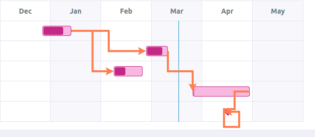
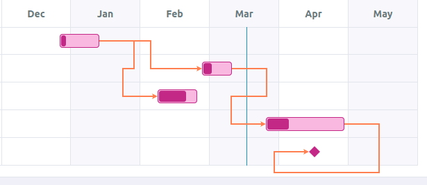
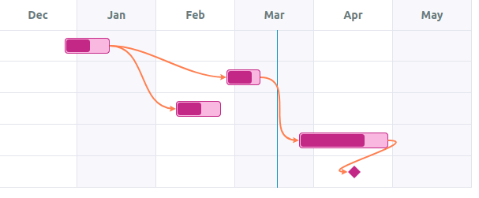

# Library to draw arrows between tasks

* Status: Accepted
* Deciders: Nicolas TERRAY
* Date: 2021-03-29

Technical story: [story #19734][1]: have a Roadmap widget on dashboard

## Context and Problem Statement

We want to be able to show the dependency between two tasks. This is reified
by an arrow from the end of a task to the start of its dependency.

See mockup:

## Considered options

* Use [leader-line](https://github.com/anseki/leader-line)
* Write our own library

## Decision Outcome

Chosen option: "Write our own library", because leader-line does not allow following precisely the mockup.

### Positive consequences

We have more control of the look 'n feel.

### Negative consequences

We have to write SVG path by hand. It may be difficult to adjust for future design decision changes.

## Pros and Cons of the Options

### leader-line

* Good, because it is really easy to use
* Good, because it works well
* Good, because it has a lot of configuration options
* Bad, because it is difficult to have a decent path for our context. See examples:

### Write our own library

* Good, because we can be closer to the mockup
* Good, because it is one less dependency
* Good, because it is a good opportunity to learn the syntax of [SVG path][2] 😅
* Bad, because it complexifies the development (both contributions and reviews) of the overall feature.

[1]: https://tuleap.net/plugins/tracker/?aid=19734
[2]: https://developer.mozilla.org/en-US/docs/Web/SVG/Tutorial/Paths
